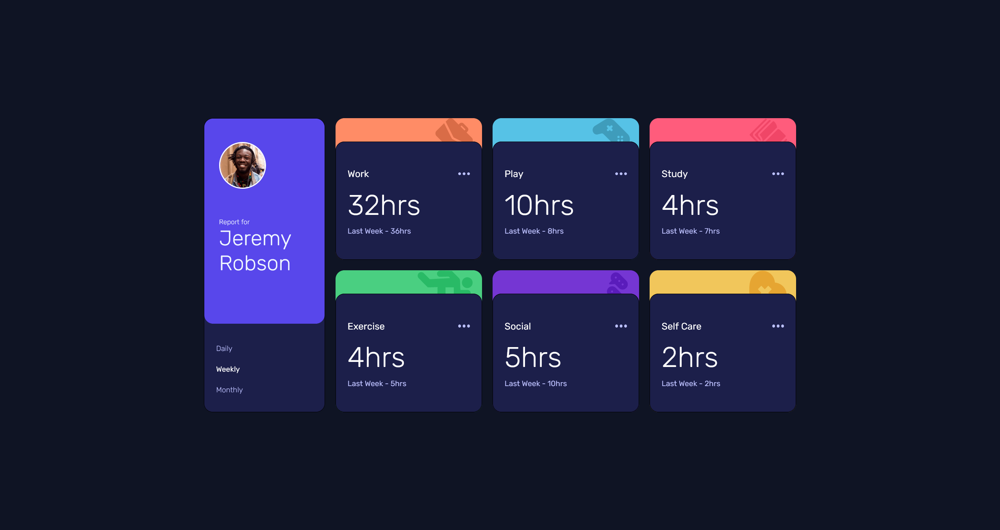
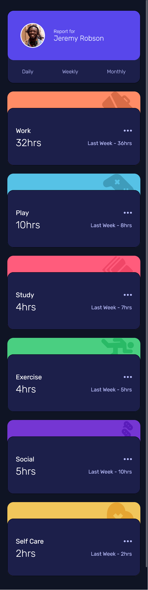

## Table of contents

- [Overview](#overview)
  - [The challenge](#the-challenge)
  - [Screenshot](#screenshot)
  - [Links](#links)
- [My process](#my-process)
  - [Built with](#built-with)
  - [What I learned](#what-i-learned)
  - [Continued development](#continued-development)
  - [Useful resources](#useful-resources)
- [Author](#author)

## Overview

### The challenge

Users should be able to:

- View the optimal layout for the site depending on their device's screen size
- See hover states for all interactive elements on the page
- Switch between viewing Daily, Weekly, and Monthly stats

### Screenshot

### Links

- Solution URL: [Github Repository](https://github.com/develover-sk/time-tracking-dashboard)
- Live Site URL: [Live Site](https://develover-sk.github.io/time-tracking-dashboard/)

## My process

### Built with

- HTML5
- CSS custom properties
- Flexbox
- CSS Grid
- Mobile-first workflow

### What I learned

From this project, I learned to structure HTML according to design required to implement CSS Grid and Flexbox together. There was a lot of learning for CSS Grid, Flexbox, custom CSS properties, and how to use json to populate data from json file.

### Continued development

I'll be pixel perfecting this design to accomodate exact same as the challenge.

### Useful resources

- [CSS Grid](https://www.w3schools.com/css/css_grid.asp) - This resource is handy to refer quickly for any CSS Grid properties.
- [Parsing JSON](https://www.freecodecamp.org/news/json-stringify-example-how-to-parse-a-json-object-with-javascript/) - This article was helpful in recalling the concept of fetch and parsing JSON.
- [Mouse Event](https://developer.mozilla.org/en-US/docs/Web/API/Element/mouseover_event) - MDN was helpful in setting up mouse event for handling the hover effect.

## Author

- Website - [Shailendra Kumar](https://www.shailendra.xyz)
- Frontend Mentor - [@develover-sk](https://www.frontendmentor.io/profile/develover-sk)
- Twitter - [@shailendrakrsk\_](https://www.twitter.com/shailendrakrsk_)
